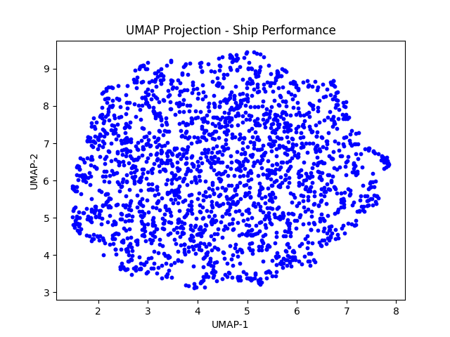

#  Ship Performance Clustering using UMAP + KMeans

##  Overview
This project performs **unsupervised clustering** on a ship performance dataset to discover hidden patterns among different ships based on their performance metrics.  
We used **UMAP** for dimensionality reduction and **KMeans** for clustering to visualize and analyze ship behavior in a 2D space.

---

##  Project Workflow

1. **Data Cleaning**
   - Removed missing or null rows from the dataset.
   - Saved the cleaned file as `ship_performance_cleaned.csv`.

2. **Feature Scaling & Dimensionality Reduction (UMAP)**
   - Standardized numerical features using `StandardScaler`.
   - Reduced data dimensions to 2D using **UMAP** for visualization.
   - Saved output as `ship_umap_output.csv`.

3. **Clustering with KMeans**
   - Trained a KMeans model on UMAP output (`ship_umap_output.csv`).
   - Number of clusters: **8**
   - Evaluated using **Silhouette Score** → `0.3494`
   - Saved trained model as `kmeans_umap_model.pkl`

4. **Visualization**
   - Plotted UMAP-reduced data points in 2D space.
   - Each point represents a ship, clustered based on performance.
   -  

---

## Results 
- **clusters formed** : 8
- **Silhouette Score** : 0.3494
- **Observation**: UMAP effectively separated the ships into visually distinct groups based on performance metrics

